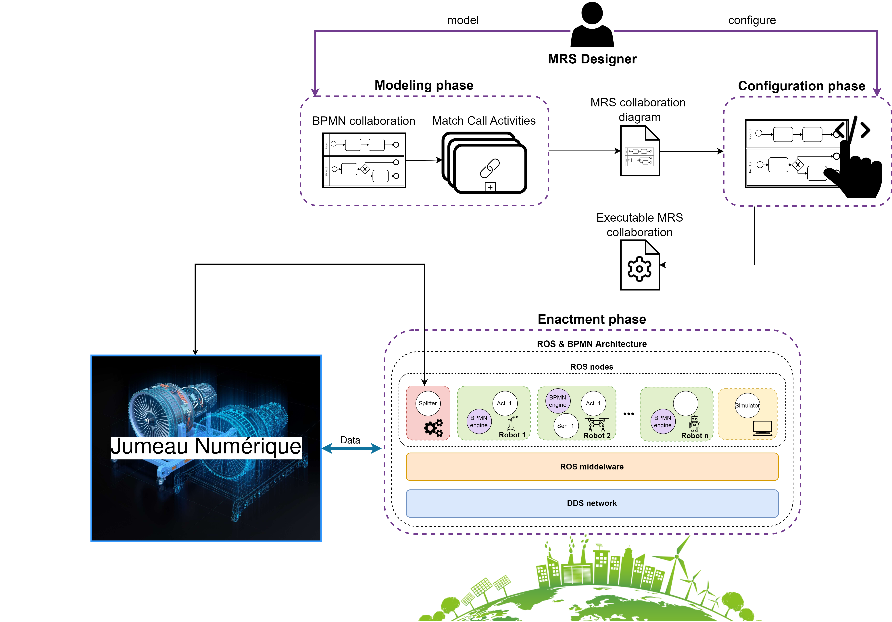

# Progression tâches PFE 2025

## Author : Thomas VITA

## Tâche 1 - Maitrise du drone Tello & SDK

### Spécificités techniques et mécaniques du drone Tello

1. **Caractéristiques Techniques du Tello** :

    - Dimensions et Poids :
        - Poids : Environ 87 g (avec hélices et batterie)
        - Dimensions : 98 × 92,5 × 41 mm
        - Taille des hélices : 3 pouces

    - Fonctions Intégrées :
        - Télémètre
        - Baromètre
        - LED
        - Système de vision
        - Wi-Fi 802.11n 2,4 GHz
        - Transmission vidéo en direct 720p
        - Port de charge Micro USB

    - Performances de Vol :
        - Distance maximale de vol : 100 m
        - Vitesse maximale : 8 m/s (17,8 mph)
        - Temps de vol maximal : 13 minutes
        - Altitude maximale de vol : 30 m
        - Fonctionnement du Télémètre : entre 0.3 m et 10 m (optimal entre 0.3 m et 6 m)

    - Batterie :
        - Batterie amovible : 1,1 Ah / 3,8 V
        - 1S 1100mAh 

    - Caméra :
        - Photos : 5 MP (2592 × 1936)
        - Champ de vision (FOV) : 82,6°
        - Vidéo : HD 720p à 30 images par seconde
        - Formats : JPG (photos), MP4 (vidéos)
        - Stabilisation électronique de l'image (EIS) : Oui

    - Unité de Traitement de la Vision :
        - VPU (Visual Positionning Unit) Movidius Myriad 2 d'Intel
        - The CPU in the Intel Movidius Myriad 2 VPU is a SPARC microprocessor core that runs custom firmware.
        - Entre 80 et 150 GFLOPS tout en consommant environ 1 watt de puissance
        - Processeur 14 cœurs
        - Fréquence de base : 933 MHz
        - Type de mémoire : 4GB LP-DDR3 with 32-bit interface at 733MHz
        - Température maximale de fonctionnement : 105 °C
        - Température minimale de fonctionnement : -40 °C

    Infos complémentaires sur le VPU : https://github.com/MrJabu/RyzeTelloFirmware/blob/master/README.md
    
    - Moteurs :
        - 4 moteurs brushed

🛠️ Solutions pour stabiliser le drone Tello en extérieur en cas de vent :

    ✅ Envoyer des commandes fréquentes pour éviter la dérive
    ✅ Utiliser les données IMU pour ajuster en temps réel
    ✅ Réduire la vitesse et l’angle d’inclinaison
    ✅ Maintenir une altitude stable
    ✅ Ajouter un poids léger pour limiter les secousses
    ✅ Procédure d’urgence en cas de perte de contrôle

2. Liens vers les Documentations et Sites Utiles :

    - Site Officiel du Tello :
        - https://www.ryzerobotics.com/tello

    - Spécifications Complètes :
        - https://www.ryzerobotics.com/tello/specs

    - Manuels et Documents :
        - https://www.ryzerobotics.com/tello/downloads

    - Guide de l'Utilisateur du Tello SDK 2.0 :
        - https://dl-cdn.ryzerobotics.com/downloads/Tello/Tello%20SDK%202.0%20User%20Guide.pdf

    - Manuel de l'Utilisateur du Tello :
        - https://dl-cdn.ryzerobotics.com/downloads/Tello/Tello%20User%20Manual%20v1.4.pdf

### Maitrise SDK 

**1️⃣ Contrôle de base du drone 🚁**

👉 Commandes essentielles pour piloter le drone

    takeoff → Faire décoller le drone
    land → Faire atterrir le drone
    emergency → Couper immédiatement les moteurs en cas de problème

👉 Déplacements en 2D

    up/down X → Monter / Descendre de X cm
    left/right X → Se déplacer à gauche / droite de X cm
    forward/back X → Avancer / Reculer de X cm

👉 Rotations

    cw X → Rotation horaire de X degrés
    ccw X → Rotation antihoraire de X degrés

👉 Mouvements avancés

    flip X → Faire un flip (l = gauche, r = droite, f = avant, b = arrière)
    go x y z speed → Aller à une position relative (x, y, z) avec une vitesse donnée

**2️⃣ Récupération des capteurs 📡**

👉 Informations sur le drone en temps réel

    battery? → Niveau de batterie 🔋
    speed? → Vitesse actuelle
    time? → Temps de vol depuis le dernier décollage
    height? → Hauteur actuelle
    temp? → Température interne du drone
    attitude? → Orientation (pitch, roll, yaw)
    baro? → Altitude barométrique
    tof? → Distance mesurée par le capteur ToF (Time of Flight)
    wifi? → Signal Wi-Fi

**3️⃣ Vidéo et traitement d’image 🎥**

👉 Activation et récupération du flux vidéo

    streamon → Activer la caméra
    streamoff → Désactiver la caméra
    Exploitation OpenCV : récupérer des frames et les traiter
    Détection d’objets avec OpenCV / YOLO / TensorFlow

💡 Possibilité de :
✔ Suivre une ligne / un objet (ex. reconnaissance faciale)
✔ Mesurer la distance d’un objet via le capteur ToF
✔ Analyser les couleurs ou formes

**4️⃣ Mode autonome (path planning & IA) 🤖**

👉 Génération de trajectoires intelligentes

    Mouvements précis avec go x y z speed et curve x1 y1 z1 x2 y2 z2 speed
    Navigation autonome en combinant IMU + capteur ToF + OpenCV
    Suivi d’une cible grâce à un tracking OpenCV

💡 Idée avancée :

    Mapping de la pièce en utilisant le capteur ToF pour cartographier l’espace
    Évitement d’obstacles en combinant ToF + flux vidéo

**5️⃣ Communication avancée & ROS2 🛰**

👉 Connexion à ROS2 pour une intégration robotique avancée

    Utiliser tello_ros2 pour intégrer le drone dans ROS2
    Publier les données capteurs en temps réel (/tello/state)
    Contrôler le drone via un script ROS2

💡 Applications possibles :
✔ Automatisation avancée avec des scripts de mission
✔ Commandes via joystick avec ROS
✔ Gestion multi-drones en swarming

**6️⃣ Interaction avec d'autres appareils 📡**

👉 Contrôle via d’autres interfaces

    Manette / Joystick en mappant les commandes sur les boutons
    Commande vocale avec un assistant IA (speech_recognition en Python)
    Application mobile customisée via un serveur Flask + WebRTC

💡 Idées avancées :
✔ Pilotage en réalité augmentée (ex. afficher un HUD via OpenCV)
✔ Drone contrôlé via un gant sensoriel

**7️⃣ Enregistrement de vols & replay 📊**

👉 Sauvegarde et analyse des données

    Stocker les données (height, speed, yaw, etc.) dans un CSV ou une base de données
    Visualisation des trajectoires avec Matplotlib ou ROS RViz
    Replay de vols avec un simulateur Python

💡 Idée avancée :
✔ Comparer les performances entre plusieurs vols pour optimiser la précision

## Tâche 2 - Exemples de scénarios avec un drone Tello

### Scénario de suivi de chemin avec détection d'obstacles pour faire le tour du batiment S de l'ENSTA

**Objectif**

Créer udes tests pour que le Tello puisse se déplacer autour d'une table dans une salle en intérieur pour tester en fonction de la manière dont il se déplace la consommation de batterie.

**Explication**

On fait 2 scénarios principaux : 

        - Un où le drone Tello tourne à hauteur fixe autour de la table et en dessous de 20% de batterie, il atterit
        - Un où le drone Tello tourne autour de la table en suivant un déplacement sinusoïdal et en dessous de 20% de batterie, il atterit

## Tâche 3 - Exécutions du jumeau numérique de Chenyu

https://docs.google.com/document/d/1mqiyiYTS2s4OKRGphC7owGKzv7TWk3-Xgd-ZM5Mygl0/edit?tab=t.0

cd ~/tello_ros_ws
colcon build
source install/setup.bash
export GAZEBO_MODEL_PATH=${PWD}/install/tello_gazebo/share/tello_gazebo/models
source /usr/share/gazebo/setup.sh
ros2 launch tello_gazebo tello_synchro_launch.py

## Tâche 4 - Prise en main du framework FAME

**Prise en main de BPMN**

FAME étant basé principalement sur BPMN, il va falloir commencer par prendre en main ce langage.

BPMN (Business Process Model and Notation)est un langage graphique standard pour modéliser des processus.

À la base, ça sert à décrire des processus métier (exemple : commander un produit en ligne), mais... ça marche aussi pour décrire n'importe quel enchaînement d'actions logiques.

👉 Ce qui nous intéresse ici, c'est que BPMN peut servir à programmer des comportements complexes pour un ou plusieurs drones sans écrire trop de code.

**Objectifs**

-> Modéliser à l'aide de BPMN 4 scénarios opérationnels indoors avec le Tello

### Premier scénario 

1. Objectif de la mission

Scanner une fenêtre en effectuant un mouvement de balayage automatique (gauche-droite + montée progressive) afin d'enregistrer une vidéo de la fenêtre tout en optimisant l'autonomie du drone.

2. Conditions Initiales

    - Position initiale : à 150 ± 2 cm du mur de couleur blanche avec la fenêtre au niveau du bord gauche de cette dernière sur la marque en croix noir

    - Orientation : Drone face à la fenêtre

    - Altitude initiale : 0 cm (décollage depuis le sol)

    - Fenêtre : 80 ± 2 cm de large, 180 ± 2 cm de haut

    - Batterie minimale pour exécution : 75%

    - Aucun obstacle situé devant le drone

    - Utilisation d'un drone EDU Tello non modifié sans ajout

3. Déroulement du Scénario

    - Phase 1 - Décollage & Calibration

        - 1. Démarrage du drone, connexion WIFI au drone et initialisation des capteurs.

        - 2. Décollage vertical à l'aide des commandes SDK jusqu'à 120 ± 2 cm et ascension verticale jusqu'à 180 ± 2 cm.

        - 3. Enregistrement vidéo activé.

        - 4. Mesure de la batterie initiale avec la commande SDK _battery?_.

        - 5. Début du chronomètre.

    - Phase 2 - Balayage Horizontal

        - 6. Déplacement en avant de 100 ± 2 cm à une vitesse comprise entre 0.5 ± 0.1 m/s et 1 ± 0.1 m/s 

        - 7. Le drone se trouve au niveau bord gauche de la fenêtre à ± 2 cm

        - 8. Mouvement à vitesse constante comprise entre 0.5 ± 0.1 m/s et 1 ± 0.1 m/s vers la droite sur 80 ± 2 cm.

        - 9. Pause de 2 secondes.

        - 10. Retour vers à vitesse constante comprise entre 0.5 ± 0.1 m/s et 1 ± 0.1 m/s la gauche sur 80 ± 2 cm.

        - 11. Incrémentation du compteur de tours.

        - 12. Mesure de la batterie après chaque balayage avec _battery?_.

        - 13. Montée à vitesse constante comprise entre 0.5 ± 0.1 m/s et 1 ± 0.1 m/s de 10 ± 2 cm.

        - 14. Répétition des points 8 à 13 jusqu'à atteindre 300 ± 2 cm de hauteur (2/3 de la fenêtre).

    - Phase 3 - Retour & Balayage Inverse

        - 15. Une fois au 2/3 de la fenêtre, le drone redescend à vitesse constante comprise entre 0.5 ± 0.1 m/s et 1 ± 0.1 m/s de 10 ± 2 cm à chaque balayage tout en effectuant les mêmes mouvements de gauche/droite.

        - 16. Incrémentation du compteur de tours.

        - 17. Mesure de la batterie après chaque balayage avec _battery?_.

        - 18. Le processus se poursuit jusqu'à atteindre l'altitude de départ (180 ± 2 cm).

    - Phase 4 - Surveillance de la Batterie
        
        - 19. Toutes les 10 secondes, le niveau de batterie est vérifié.

        - 20. Si le niveau de batterie atteint 15% ou moins, le drone interrompt immédiatement la mission et passe à la phase d'atterrissage.

        - 21. Chronomètre arrêté lorsque la batterie atteint 15%.

    - Phase 5 - Retour & Atterrissage

        - 22. Le drone recule à vitesse constante comprise entre 0.5 ± 0.1 m/s et 1 ± 0.1 m/s de 100 ± 2 cm pour quitter la zone de balayage.

        - 23. Descente progressive jusqu'à 0 cm sur la marque en croix noir au sol.

        - 24. Arrêt de l'enregistrement vidéo.

        - 25. Mesure finale de la batterie avec _battery?_.

4. Contraintes

    - Vitesse de balayage limitée entre 0.5 ± 0.1 m/s et 1 ± 0.1 m/s pour assurer une bonne qualité vidéo.

    - Respect des positions définies

    - Arrêt automatique en cas de perte de connexion ou de batterie faible.

    - Atterissage au niveau du marquage au sol.

    - Mesure du temps total en secondes à ± 1s près, nombre de tours précis au tours près et affichage de la consommation de batterie à chaque tour.

5. Critères de Réussite

    - Vidéo continue sans coupure.

    - Respect des positions prédéfinies.

    - Arrêt automatique à 15% de batterie.

    - Atterrissage au niveau du marquage au sol.

6. Méthodes de mesure

    - Temps Total : Mesuré par une fonction Python utilisant time.time() au début et à la fin du scénario.

    - Nombre de Tours : Incrémenté à chaque balayage gauche-droite.

    - Consommation de Batterie : Relevée grâce à la commande SDK _battery?_ avant et après chaque balayage et stockée dans une liste Python.

7. Diagramme BPMN

### Second scénario 

1. Objectif de la mission

Effectuer une inspection horizontale continue d'un mur en intérieur en enregistrant une vidéo, avec des déplacements réguliers et une montée progressive, tout en mesurant :

- Le temps total d'exécution du scénario.

- Le nombre de balayages horizontaux.

- La consommation de batterie à chaque phase.

2. Conditions Initiales

    - Position initiale : à 150 ± 2 cm du mur de couleur blanche du bord gauche sur la marque en croix noir au sol

    - Orientation : Drone face au mur

    - Altitude initiale : 0 cm (décollage depuis le sol) sur le marquage au sol

    - Mur : 200 ± 2 cm de large, 180 ± 2 cm de haut

    - Batterie minimale pour exécution : 30%

    - Aucun obstacle situé devant le drone

    - Utilisation d'un drone EDU Tello non modifié

3. Déroulement du Scénario

    - Phase 1 - Décollage & Calibration

        - 1. Démarrage du drone, connexion WIFI au drone et initialisation des capteurs.

        - 2. Décollage vertical à l'aide des commandes SDK jusqu'à 120 ± 2 cm

        - 3. Enregistrement vidéo activé _streamon_.

        - 4. Mesure de la batterie initiale avec la commande SDK _battery?_.

        - 5. Début du chronomètre.

    - Phase 2 - Balayage Horizontal

        - 6. Déplacement en avant de 100 ± 2 cm à une vitesse comprise entre 0.5 ± 0.1 m/s et 1 ± 0.1 m/s .

        - 7. Le drone se trouve au bord gauche du mur.

        - 8. Mouvement vers la droite sur 200 ± 2 cm à une vitesse comprise entre 0.5 ± 0.1 m/s et 1 ± 0.1 m/s .

        - 9. Pause de 2 secondes.

        - 10. Retour vers la gauche sur 200 ± 2 cm à une vitesse comprise entre 0.5 ± 0.1 m/s et 1 ± 0.1 m/s.

        - 11. Incrémentation du compteur de balayages.

        - 12. Mesure de la batterie après chaque balayage avec _battery?_.

        - 13. Montée de 10 ± 1 cm à une vitesse comprise entre 0.5 ± 0.1 m/s et 1 ± 0.1 m/s.

        - 14. Répétition des points 8 à 13 jusqu'à atteindre 180 ± 2 cm de hauteur.

    - Phase 3 - Surveillance de la Batterie
        
        - 15. Toutes les 10 secondes, le niveau de batterie est vérifié.

        - 16. Si le niveau de batterie atteint 15% ou moins, le drone interrompt immédiatement la mission et passe à la phase d'atterrissage.

        - 17. Chronomètre arrêté lorsque la batterie atteint 15%.

    - Phase 4 - Retour & Atterrissage

        - 22. Le drone recule à vitesse constante comprise entre 0.5 ± 0.1 m/s et 1 ± 0.1 m/s de 100 ± 2 cm pour quitter la zone de balayage.

        - 23. Descente progressive jusqu'à 0 cm sur la marque en croix noir au sol.

        - 24. Arrêt de l'enregistrement vidéo.

        - 25. Mesure finale de la batterie avec _battery?_.

4. Contraintes

    - Vitesse de balayage limitée entre 0.5 ± 0.1 m/s et 1 ± 0.1 m/s pour assurer une bonne qualité vidéo.

    - Respect des positions définies

    - Arrêt automatique en cas de perte de connexion ou de batterie faible.

    - Atterissage au niveau du marquage au sol.

    - Mesure du temps total en secondes à ± 1s près, nombre de tours précis au tours près et affichage de la consommation de batterie à chaque tour.

5. Critères de Réussite

    - Vidéo continue sans coupure.

    - Respect des positions prédéfinies.

    - Arrêt automatique à 15% de batterie.

    - Atterrissage au niveau du marquage au sol.

6. Méthodes de mesure

    - Temps Total : Mesuré par une fonction Python utilisant time.time() au début et à la fin du scénario.

    - Nombre de Tours : Incrémenté à chaque balayage gauche-droite.

    - Consommation de Batterie : Relevée grâce à la commande SDK _battery?_ avant et après chaque balayage et stockée dans une liste Python.

7. Diagramme BPMN

### Troisième scénario 

1. Objectif de la mission

Effectuer une inspection circulaire autour d'un point central avec enregistrement vidéo, tout en mesurant :

- Le temps total d'exécution du scénario.

- Le nombre de tours complets.

- La consommation de batterie à chaque phase.

2. Conditions Initiales

    - Position initiale : à environ 100 ± 2 cm du mur aligné sur la position du point central rouge

    - Orientation : Drone face au mur

    - Altitude initiale : 0 cm (décollage depuis le sol) positionné sur un marquage au sol (croix noir)

    - Point central de couleur rouge placé sur un mur à 100 ± 2 cm de haut

    - Batterie minimale pour exécution : 75%

    - Aucun obstacle situé devant le drone

    - Utlisation d'un drone EDU Tello non modifié

3. Déroulement du Scénario

    - Phase 1 - Décollage & Calibration

        - 1. Démarrage du drone, connexion WIFI au drone et initialisation des capteurs.

        - 2. Décollage vertical à l'aide des commandes SDK jusqu'à 100 ± 2 cm

        - 3. Enregistrement vidéo activé.

        - 4. Mesure de la batterie initiale avec la commande SDK _battery?_.

        - 5. Début du chronomètre.

    - Phase 2 - Mouvement en spiral

        - 6. Rotation horizontale de 360° autour du point central avec un rayon de 30 ± 2 cm.

        - 7. Incrémentation du nombre de tours tous les 360°

        - 8. Pause de 2 secondes.

        - 9. Mesure de la batterie avec battery?.

        - 10. Répétition des étapes 6 à 9 jusqu'à atteindre 180 ± 2 cm ou 15% de batterie ou moins.

    - Phase 3 - Surveillance de la Batterie
        
        - 15. Toutes les 10 secondes, le niveau de batterie est vérifié.

        - 16. Si le niveau de batterie atteint 15% ou moins, le drone interrompt immédiatement la mission et passe à la phase d'atterrissage.

        - 17. Chronomètre arrêté lorsque la batterie atteint 15%.

    - Phase 4 - Retour & Atterrissage

        - 22. Le drone recule à vitesse constante comprise entre 0.5 ± 0.1 m/s et 1 ± 0.1 m/s de 100 ± 2 cm pour quitter la zone de balayage.

        - 23. Descente progressive jusqu'à 0 cm sur la marque en croix noir au sol.

        - 24. Arrêt de l'enregistrement vidéo.

        - 25. Mesure finale de la batterie avec _battery?_.

4. Contraintes

    - Vitesse de balayage limitée entre 0.5 ± 0.1 m/s et 1 ± 0.1 m/s pour assurer une bonne qualité vidéo.

    - Respect des positions définies

    - Arrêt automatique en cas de perte de connexion ou de batterie faible.

    - Atterissage au niveau du marquage au sol.

    - Mesure du temps total en secondes à ± 1s près, nombre de tours précis au tours près et affichage de la consommation de batterie à chaque tour.

5. Critères de Réussite

    - Vidéo continue sans coupure.

    - Respect des positions prédéfinies.

    - Arrêt automatique à 15% de batterie.

    - Atterrissage au niveau du marquage au sol.

6. Méthodes de mesure

    - Temps Total : Mesuré par une fonction Python utilisant time.time() au début et à la fin du scénario.

    - Nombre de Tours : Incrémenté à chaque balayage gauche-droite.

    - Consommation de Batterie : Relevée grâce à la commande SDK _battery?_ avant et après chaque balayage et stockée dans une liste Python.

7. Diagramme BPMN

### Dernier scénario opérationnel

1. Objectif de la mission

Effectuer une inspection linéaire d'un mur dans un couloir pour détecter des fissures. À chaque fissure détectée, le drone s'arrête pour enregistrer une photo, puis poursuit sa trajectoire jusqu'à la fin du mur ou jusqu'à ce que la batterie atteigne 15%.

2. Conditions Initiales

    - Position initiale : à 20 ± 2 cm du mur le plus à gauche du couloir que l'on souhaite analyser.

    - Orientation : Drone orienté vers le mur.

    - Mur à analyser sur 400 ± 10 cm

    - Altitude initiale : 0 cm (au sol).

    - Batterie minimale pour exécution : 75%.

    - Utilisation d'un drone EDU Tello non modifié

    - Couloir avec 4 fissures épaisses longitudinales de longueurs comprises entre 5 cm et 10 cm

    - En intérieur avec de l'éclairage (lumière à au moins environ 100 lm/m²)

3. Déroulement du Scénario

    - Phase 1 - Décollage & Préparation

        - 1. Démarrage du drone et connexion WIFI au drone.

        - 2. Décollage vertical à l'aide des commandes SDK jusqu'à 150 ± 2 cm.

        - 3. Activation de la caméra.

        - 4. Mesure initiale de la batterie avec _battery?_.

        - 5. Début du chronomètre et compteur de fissures initialisé.

    - Phase 2 - Balayage Linéaire

        - 6. Se déplacer à vitesse constante comprise entre 0.1 ± 0.01 m/s vers la droite parralèlement au mur sur 5 ± 0.5 cm.

        - 7. Capturer une photo avec la caméra du Tello

        - 8. Analyse d'image via algo de segmentation pour détection de fissures longitudinales.

        - 9. Si une fissure est détectée :

            - 10. Enregistrer la photo de la fissure

            - 11. Incrémenter le compteur de fissures

            - 12. Reprise de la trajectoire.

        - 13. Vérification de la batterie avec battery? toutes les 10 secondes.

        - 14. Répétition des étapes 6 à 13 jusqu'à atteindre la fin du couloir à 5 cm près ou 15% de batterie.

    - Phase 3 - Surveillance de la Batterie

        - 15. Si la batterie atteint 15% ou moins, le drone interrompt immédiatement la mission et passe à la phase d'atterrissage.

    - Phase 4 - Retour & Atterrissage

        - 16. Arrêt de la caméra.

        - 17. Mesure finale de la batterie.

        - 18. Chronomètre arrêté.

        - 19. Atterrissage immédiat au sol sans retour à la base.

4. Contraintes

    - Détection des fissures par traitement d'image simple (détection de contours).

    - Vitesse constante pour assurer une couverture uniforme.

    - Arrêt automatique en cas de batterie faible.

5. Critères de Réussite

    - Détection correcte des fissures.

    - Nombre de photos prises correspond au nombre de fissures visibles sur la vidéo.

    - Arrêt automatique à 15% de batterie.

6. Méthode de Mesure

    - Temps Total : Mesuré par time.time().

    - Nombre de Fissures : Comptabilisé par le nombre de photos prises et le compteur.

    - Consommation de Batterie : Mesurée avec battery?.

7. Diagramme BPMN

### Apprentissage BPMN

**Exploration**

- Complexité : par l'exploration complète du modèle.
- Accessibilité : identification des chemins inaccessibles.
- Impasse : identification des scénarios de blocage.
- Propriété : vérification d'une propriété exprimée dans un diagramme PSC (Property Sequence
Chart) ou GPSL (Generic Property Specification Language).

Sur PragmaDev Process : 

    La boîte de dialogue montre la progression de l'exploration :
    - Nb transitions tirées est le nombre de transitions exécutées dans le modèle depuis le
    début de l'exploration ;
    - Configurations est le nombre d'états distincts du système que l'exploration a vu
    jusqu'à présent ;
    - Couverture est le pourcentage de symboles exécutés au moins une fois pendant l'explora-
    tion par rapport au nombre total de symboles dans le(s) modèle(s) exploré(s) ;
    - Statut indique si l'exploration est en cours et toujours incomplète ou si elle est
    terminée ;
    - Résultat est le résultat de l'exploration, le cas échéant.

## Tâche 5 

## Tâche 6 - Devis pour analyse du batiment S

### Hypothèses

Les surfaces sont modélisées comme des zones avec des coordonnées connues.

Chaque zone a un état : Non traité, En cours, ou Terminé.
Le jumeau numérique centralise :

    L'état des zones.
    La position et batterie des drones.
    L'historique des zones déjà scannées.

Les drones peuvent communiquer avec le jumeau numérique en temps réel via ROS2.

### Logique

1. Démarrage

    - Vérification du niveau de batterie 🔋.
        - Si batterie < seuil critique → ne décolle pas.
        - Seuil critique : 30%
        - Seuil de retour : 10%
        - Sinon → Début de mission.
    - Envoie sa position initiale au jumeau numérique.
    - Récupération de l'assignation initiale de la surface :
        - Drone 1 → Surface Sud
        - Drone 2 → Surface Nord (prioritaire)
        - Drone 3 → Surface Ouest

2. Analyse de la surface assignée

    - Début du scan avec une trajectoire en serpentin ou spirale.
    - À chaque avancée, envoie régulièrement :
        - Position actuelle.
        - Pourcentage de surface traitée.
        - Niveau de batterie.

3. Batterie faible pendant le scan

    - Si batterie < seuil de retour :
        - Envoie une demande de relais au jumeau numérique.
        - Le jumeau marque la surface comme _Interrompue_.
        - Retour automatique au point de recharge.
        - Le jumeau assigne automatiquement un autre drone disponible à la zone interrompue.

4. Fin de la surface

    - Une fois la surface terminée :
        - Envoie une notification _Terminé_ au jumeau numérique.
        - Demande la surface non traitée la plus proche.
        - Si aucune surface non traitée :
            - Cherche le drone avec le plus de surface restante à traiter.
            - Va l'aider (zone la plus proche).

5. Coopération

    - Si le drone reçoit une demande d'aide par le jumeau numérique :
        - Se rend à la position indiquée.
        - Commence le scan à partir de la dernière position connue.

6. Retour à la base

    - Si toutes les surfaces sont traitées :
        - Retour automatique à la base.
        - Envoie son état final (Disponible ou Batterie faible).

### Création et test simulation Gazebo

cd ~/tello_ros_ws
source install/setup.bash
export GAZEBO_MODEL_PATH=${PWD}/install/tello_gazebo/share/tello_gazebo/models
source /usr/share/gazebo/setup.sh
ros2 launch tello_gazebo simple_launch.py

Modèles des batiments => tello_gazebo/models/mon_batiment

Code permettant de controler un tello sous Gazebo avec une manette => ici une Logitech F710 

### Controle multiple des drones Tello

1. Prérequis

    - Drones Tello EDU (2 ou plus)

    - Routeur Wi-Fi fonctionnel qui permet aux drones de se connecter à un réseau local

    - PC ou serveur connecté au même réseau Wi-Fi que les drones

    - Python 3.x installé sur le PC

    - Bibliothèque socket pour la communication avec les drones (incluse par défaut dans Python)

2. Connexion des drones au routeur

Il est important de préciser que les drones Ryze Tello normaux ne peuvent pas se connecter à un routeur Wifi et peuvent uniquement se connecter en Wifi direct, d'où l'utilisation unique de EDU Tello.

**Étapes de Configuration**

1. Connecter le PC et les Drones au Routeur WiFi

    Allumez chaque drone Tello et connectez-les à votre routeur WiFi via un script ou manuellement.

    Assurez-vous que chaque drone ait une adresse IP fixe pour faciliter leur identification sur le réseau local.

    Vérifiez que les drones sont connectés au routeur avec des commandes comme ping.

2. Télécharger et Installer les Dépendances

- Sur votre PC, installez Python 3 et les bibliothèques nécessaires :

        sudo apt update
        sudo apt install python3 python3-pip
        pip3 install opencv-python numpy

3. Créer le Script tello_cli.py

Créez un fichier Python appelé tello_cli.py pour envoyer des commandes UDP aux drones Tello. Voici le code à copier dans le fichier :

    import socket

    #Adresse IP et port du drone Tello

    TELLO_IP = "192.168.10.1"
    TELLO_PORT = 8889
    ADDRESS = (TELLO_IP, TELLO_PORT)

    # Créer une socket UDP

    sock = socket.socket(socket.AF_INET, socket.SOCK_DGRAM)
    sock.bind(("", 9000))  # Port local pour recevoir les réponses du drone

    def send_command(command):
        """ Envoie une commande au drone et affiche la réponse """
        try:
            print(f"Envoi : {command}")
            sock.sendto(command.encode(), ADDRESS)
            
            # Attendre la réponse
            response, _ = sock.recvfrom(1024)
            print(f"Réponse : {response.decode()}")
        except Exception as e:
            print(f"Erreur : {e}")

    # Passer le drone en mode SDK

    send_command("command")

    # Faire décoller le drone
    send_command("takeoff")

    # Attendre 5 secondes avant d'atterrir
    import time
    time.sleep(5)

    # Atterrir
    send_command("land")

    # Fermer la socket
    sock.close()

4. Exécuter le Script

Une fois le fichier créé et sauvegardé, vous pouvez l'exécuter avec la commande suivante :

    python3 tello_cli.py

Ce script va activer le mode SDK du drone, le faire décoller, attendre 5 secondes et le faire atterrir.

5. Gérer Plusieurs Drones

Pour contrôler plusieurs drones, chaque Tello doit être connecté en mode WiFi STA (client) sur le même réseau local. Voici la démarche :

- Connectez chaque drone Tello à votre routeur WiFi (ils recevront une adresse IP fixe).

- Exécutez le script pour chaque drone en parallèle sur le PC.

**Schéma adapté avec jumeau numérique**

### Génération automatique du monde Gazebo et de l'environnement

Dans le dossier "Générer automatiquement monde Gazebo", "script.py" permet de générer un fichier .world de notre environnement et des modèles de batiments autours d'une coordonnées GPS sur un rayon de 300m en se basant sur la base de données OSM2World.

## Module de tir pour drône DJI Avata 2

### Objectifs

-> Type de fléchettes : ventouse ? mousse ? mini harpon pour cible molle ?

-> Portée souhaitée : distance, précision ?

-> Nombre de fléchettes à tirer ?

-> Méthode de tir : ressort, élastique, air comprimé, servo, etc. ?

-> Rechargement manuel

-> Poids maximal autorisé (le DJI Avata 2 a une charge utile très limitée – autour de 100 à 150 g sans trop altérer sa stabilité).

| Élément                  | Option choisie                      | Justification                                                    |
|--------------------------|-------------------------------------|------------------------------------------------------------------|
| Mécanisme de propulsion  | Élastique tendu                     | Léger, simple, pas de moteur ni compresseur                     |
| Déclencheur              | Micro servo SG90 (9g)               | suffisant pour libérer un crochet ou une goupille               |
| Contrôle                 | ESP32 mini (8g) ou Timer autonome   | Léger, consommation négligeable                           |
| Alim                     | Mini LiPo 1S (150–200 mAh)          | ~10g max, suffisant pour quelques tirs                          |
| Fixation                 | Serre-câbles + impression 3D minimaliste | Pas de visserie lourde ni plaque inutile                    |
| Matériau                 | PLA light ou PETG léger             | Suffisamment solide, mais optimisé en infill (genre 15%)        |

